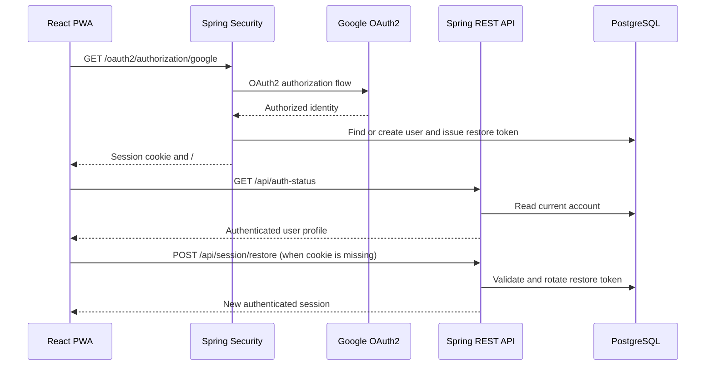
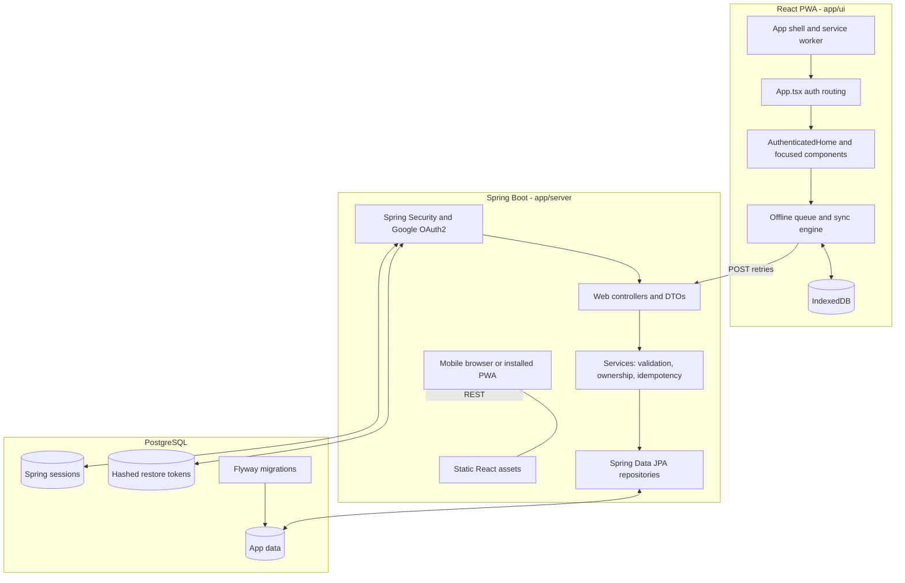
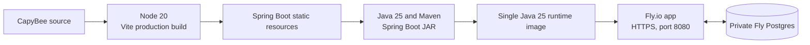

# CapyBee Architecture

CapyBee is a privacy-first companion app for children adapting to a new country. It combines a React progressive web app with a Spring Boot REST API and PostgreSQL persistence. The repository is a monorepo: the UI lives in `app/ui`, the backend lives in `app/server`, and the root [Dockerfile](../Dockerfile) packages both into one deployable service.

## Architecture Overview

The browser loads an installable React app shell. The app serves a kid-facing experience for daily check-ins, small missions, a private friendship tracker, Old World and New World memories, and a honeycomb progress view.

The frontend calls authenticated `/api` endpoints. Spring Security handles Google OAuth2 login and session-based authentication; Spring Boot controllers delegate all business rules and ownership checks to services, which use Spring Data JPA repositories to persist data to PostgreSQL. Flyway applies schema migrations during application startup.

The app is designed for mobile networks and Fly.io cold starts. Static application assets are precached by a service worker, while create actions are applied optimistically and queued in IndexedDB for background retry when connectivity returns.

## Frontend Architecture

- **React 19 + TypeScript:** Function-component application rooted in [app/ui/src/main.tsx](../app/ui/src/main.tsx). [app/ui/src/App.tsx](../app/ui/src/App.tsx) owns authentication-state routing, and [app/ui/src/AuthenticatedHome.tsx](../app/ui/src/AuthenticatedHome.tsx) provides the authenticated experience.
- **Vite 6 + Tailwind CSS:** Vite supplies the local development server and production build; Tailwind utilities and [app/ui/src/styles.css](../app/ui/src/styles.css) provide the mobile-first visual system.
- **Framer Motion:** Used for purposeful UI motion, including feature reveals and onboarding transitions.
- **Bilingual UI:** Child-facing copy is maintained in English and Polish and the selected locale is persisted with the child profile.
- **PWA app shell:** [app/ui/vite.config.ts](../app/ui/vite.config.ts) configures `vite-plugin-pwa` to precache static build assets and use `NetworkOnly` for `/api/**`, avoiding misleading cached activity data.
- **Offline write queue:** [app/ui/src/offline/queueStore.ts](../app/ui/src/offline/queueStore.ts) stores queued creates in IndexedDB through `idb-keyval`. [app/ui/src/offline/syncEngine.ts](../app/ui/src/offline/syncEngine.ts) sends them in order with a request timeout, exponential backoff, and idempotent client-generated UUIDs.

## Backend Architecture

- **Spring Boot 4.1 + Java 25:** Maven project under `app/server`, with the package root `com.capybee.server`.
- **Layered application design:** The request path is `web` controllers and DTO records to `service` business logic to `repository` Spring Data JPA repositories to `domain` JPA entities. Controllers do not access repositories directly.
- **REST API:** [app/server/src/main/java/com/capybee/server/web/ApiController.java](../app/server/src/main/java/com/capybee/server/web/ApiController.java) exposes check-in, profile, mission, friendship, and memory endpoints beneath `/api`.
- **Idempotent writes:** Create endpoints accept an optional client UUID. Services return an existing resource for a retry belonging to the same account, allowing the offline queue to safely retry requests after a lost response or interrupted connection.
- **Database migrations:** Flyway runs ordered SQL migrations from [app/server/src/main/resources/db/migration](../app/server/src/main/resources/db/migration); Hibernate uses schema validation rather than schema generation.

## Authentication And Privacy

CapyBee uses Google OAuth2 through Spring Security. On a successful sign-in, the server creates or retrieves the account, establishes a JDBC-backed server-side session, creates a short-lived local restore token, and redirects to the app with that token in the URL fragment. The frontend stores the token locally and can exchange it for a fresh session if a mobile PWA loses its session cookie.

[app/server/src/main/java/com/capybee/server/config/SecurityConfig.java](../app/server/src/main/java/com/capybee/server/config/SecurityConfig.java) explicitly allows only static assets, OAuth routes, health/status routes, and session restore/revoke routes without authentication. All remaining `/api/**` endpoints require an authenticated session. Service methods scope reads and mutations to the current parent account and its child profile; there are no child-to-child social, messaging, or sharing features.

## Component Architecture

## Persistence And Data Model

PostgreSQL is the system of record. The main application data has the following ownership relationships:

```mermaid
erDiagram
    USERS ||--o{ CHECK_INS : owns
    USERS ||--o{ MISSION_COMPLETIONS : owns
    MISSIONS ||--o{ MISSION_COMPLETIONS : completed_as
    USERS ||--o| FAMILY_PROFILES : owns
    FAMILY_PROFILES ||--o{ FRIENDSHIP_ENTRIES : contains
    FAMILY_PROFILES ||--o{ MEMORY_ENTRIES : contains
    USERS ||--o{ SESSION_RESTORE_TOKENS : receives

    USERS {
        uuid id PK
        string google_subject UK
        string email UK
    }
    FAMILY_PROFILES {
        uuid id PK
        uuid parent_user_id FK
        string nickname
        string preferred_locale
        boolean has_seen_onboarding
    }
    CHECK_INS {
        uuid id PK
        uuid user_id FK
        string mood
        string note
    }
    MISSIONS {
        uuid id PK
        string code UK
        string title
    }
    MISSION_COMPLETIONS {
        uuid id PK
        uuid mission_id FK
        uuid user_id FK
    }
    FRIENDSHIP_ENTRIES {
        uuid id PK
        uuid profile_id FK
        string person_label
        string stage
    }
    MEMORY_ENTRIES {
        uuid id PK
        uuid profile_id FK
        string world_type
        boolean is_favorite
    }
    SESSION_RESTORE_TOKENS {
        uuid id PK
        uuid user_id FK
        string token_hash
        datetime expires_at
    }
```

The full schema rationale and privacy constraints are documented in [docs/specifications/02-data-model.md](specifications/02-data-model.md). Spring Session JDBC uses its own tables, established by the corresponding Flyway migration.

## Deployment Architecture

The root Docker build has three stages. It builds the Vite UI with Node.js, copies the resulting `dist` assets into Spring Boot's static-resource directory, packages the server with Maven, and runs the executable JAR on a Java runtime image. This creates one HTTP service rather than separately deployed frontend and backend applications.

[fly.toml](../fly.toml) runs the app on port `8080`, forces HTTPS, enables Fly's suspend-and-wake behavior, and configures a health check at `/actuator/health`. The `fly` Spring profile enables secure, HTTP-only session cookies and forwarded-header handling. Database and Google OAuth credentials are injected through environment variables and deployment secrets rather than committed configuration.

## Key Runtime Flows

- **Initial app load:** The service worker serves the static app shell after it has been cached. The frontend warms the backend with an auth-status request, then loads the authentication and screen data it needs.
- **Authenticated read:** The React client sends the session cookie to an `/api` endpoint. Spring Security authorizes the request, the controller calls its service, and the service reads only records owned by the current account/profile.
- **Create while offline or waking:** The UI updates immediately, adds a client UUID to IndexedDB, and starts a background flush. The sync engine retries failed requests with exponential backoff. The backend's idempotent create handling prevents duplicate records on retry.
- **Production delivery:** A Docker image containing the UI bundle and Spring Boot JAR is deployed as one Fly.io application, which connects to PostgreSQL over Fly's private network.

## Quality Boundaries

- Backend service methods are unit-tested with JUnit 5 and Mockito, with JaCoCo enforcing service-package line coverage during `mvn verify`.
- Offline queue and sync logic are unit-tested with Vitest in the frontend's happy-dom environment.
- The UI production build runs TypeScript compilation followed by Vite and must be copied into Spring Boot static resources for local integrated testing.

For endpoint-level request and response details, see [docs/specifications/03-api-contract.md](specifications/03-api-contract.md). For product and safety intent, see [docs/CapyBee_concept.md](CapyBee_concept.md).